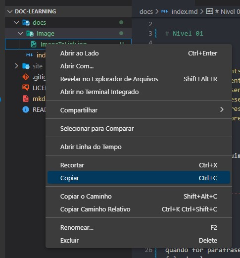

# Welcome to MkDocs

# Nivel 01

## Headings

- **'#'** represents ```<h1>```
- **'##'** represents ```<h2>```
- **'###'** represents ```<h3>```
- **'####'** represents ```<h4>```
- **'#####'** represents ```<h5>```
- **'######'** represents ```<h6>```

## Paragraph

É so escrever alguima coisa que ele ja entende como ```<p>```

## Line

é so digitar  ```---```, isso vai criar uma linha na leta

---

## Quote

quando for parafrasear algo use ```>``` no inicio da frase, como se estivesse falando algo

> assim!

## Image

use `````` para mostrar a imagem na tela


> Uma forma mais facil é ir no nome da imagem **no Editor e Copy&Paste**
>
> 

# Nivel 2

## Bold

Use  ** ```**negrito**``` para deixar algo em negrito

**negrito**

## Italic

Use  * ```*Italic*``` para deixar algo em negrito

*Italic*

## Link

parece com imagem so que sem ```!``` ou seja use ```[Nome do link](Link)```

[aqui vai pro google](https://google.com)

## CodeBlock

Use  ``` para deixar algo em negrito

```
exemplo de code

```